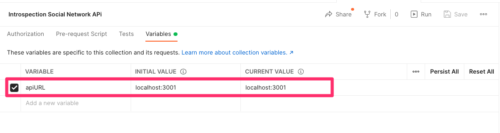
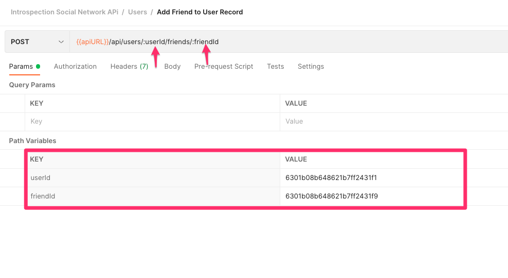
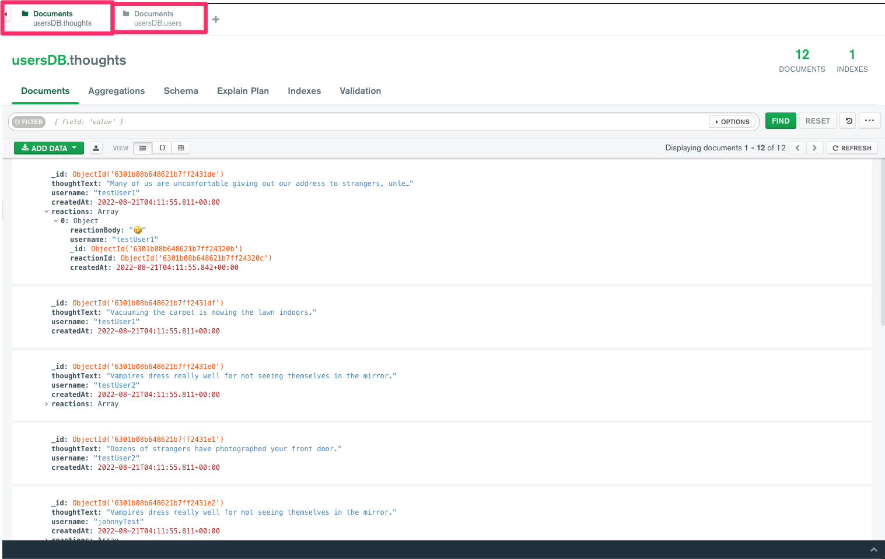

# Introspecition-Social-Network-API

The "Introspection Social Network API" is a back-end API that aims to replicate some of the functionality that is offered by some of the modern social network companies of today. The API has been built to allow you to interact with three different objects; users object, thoughts object, and reactions object. 

* Users object
    * Create a new user
    * Retrieve an existing user
    * Update an existing user
    * Delete an existing user

* Thoughts Object
    * Create a new thought
    * Retrieve an existing thought
    * Update an existing thought
    * Delete an existing thought

* Reactions Object
    * Create a new reaction
    * Delete an existing reaction

As previously mentioned, these objects have been built to mimic some of the basic functionality that is used by social media companies such as Facebook, Twitter, etc... 

## Table of Contents

* [Installation](#installation)
* [Usage](#usage)
* [Testing Through Postman](#testing-through-our-postman-collection)
* [Getting Started](#getting-started)
* [API Documentation](#api-documentation)
* 


## Installation

The following must be installed to successfully use this API: 
* Node JS
* Express JS
* Nodemon (Optional)
* MongoDB
* Mongoose

## Usage

This API has been built to work alongside a Mongo database. The users, thoughts, and reactions object have all been correlated with each other to work asynchronously. The users object should not only allow you to create, retrieve, update, and delete users but it should also allow you to see any thoughts and friends that are associated to the particular user record. For example: 

```
{
  "_id": {
    "$oid": "6301b08b648621b7ff2431fb"
  },
  "username": "johnnyTest",
  "email": "testEmail2@email.com",
  "friends": [
    {
      "$oid": "6301b08b648621b7ff2431f4"
    }
  ],
  "thoughts": [
    {
      "$oid": "6301b08b648621b7ff2431e2"
    },
    {
      "$oid": "6301b08b648621b7ff2431e3"
    }
  ]
}

```

As you can see this object contains information about the particular user as well as thoughts that have been associated to this user and friends for this particular user. 

The thoughts object has also been created to contain the reactions object within it, as you can see from the example below: 

```
{
  "_id": {
    "$oid": "6301b08b648621b7ff2431de"
  },
  "thoughtText": "Many of us are uncomfortable giving out our address to strangers, unless they bring food.",
  "username": "testUser1",
  "createdAt": {
    "$date": {
      "$numberLong": "1661055115811"
    }
  },
  "reactions": [
    {
      "reactionBody": "🤣",
      "username": "testUser1",
      "_id": {
        "$oid": "6301b08b648621b7ff24320b"
      },
      "reactionId": {
        "$oid": "6301b08b648621b7ff24320c"
      },
      "createdAt": {
        "$date": {
          "$numberLong": "1661055115842" // Timestamp will be displayed as date time when your make API requests 
        }
      }
    }
  ]
}
```

## Testing Through Our Postman Collection

I've created a postman collection that you can use to test the Introspection API. Although the API is pretty self-explanatory, please make sure that you read through the README to fully understand the functionality of this API.

[](https://app.getpostman.com/run-collection/109c14a80e21ef674f84?action=collection%2Fimport)

#### Notes: 

To make your life easier, I recommend that you take advantage of the variables that I've included. This will make it much easier to test against different environments, this will also make it easier to update your queries as you test the API. 

**Postman Collection Variables**
 </br>

**Postman Query Variables**
 </br>

## Getting Started

When testing this application, please be aware that I added some sample data for you to work with. To populate this data, please run ```node utils/seed```. Running this command will generate a set of user data, thoughts data, and reactions data that you can user to interact with the API. If you would like to expand or modify this data, please look at the files that exist with thin ```utils``` folder. Once you run this command, you will see the following data on your database: 

 </br>

## API Documentation

### User Routes
**WHERE ```{{apiURL}}``` is your root API URL.** </br>

### Retrieve Existing Users Endpoint
```GET {{apiURL}}/api/users/``` </br>

This ```GET``` route lets you make a query to our Mongo database to retrieve a list of existing users in the database. 

**Sample Request:**
```
curl --location --request GET 'localhost:3001/api/users/'
```

**Sample Response:**
```
{
    "_id": "6301b3772f448f8c81a9236d",
    "username": "tomRiddle",
    "email": "testEmail5@email.com",
    "friends": [
        "6301b3772f448f8c81a92366"
    ],
    "thoughts": [
        "6301b3772f448f8c81a92357",
        "6301b3772f448f8c81a92358"
    ],
    "friendCount": 1,
    "id": "6301b3772f448f8c81a9236d"
}
```

### Retrieve a Single User Record
```GET {{apiURL}}/api/users/:userId``` </br>

This ```GET``` route lets you send a ```userId``` in your request that retrieves a user record that matches the specified user ID. 

**Sample Request:**

```
curl --location --request GET 'localhost:3001/api/users/:userId'
```

**Sample Response:**

```
{
    "user": {
        "_id": "6301b3772f448f8c81a9236d",
        "username": "tomRiddle",
        "email": "testEmail5@email.com",
        "friends": [
            "6301b3772f448f8c81a92366"
        ],
        "thoughts": [
            "6301b3772f448f8c81a92357",
            "6301b3772f448f8c81a92358"
        ]
    }
}
```

If an invalid ```userId``` is sent in your request you will see a 500 error code and a message indicating that we could not find the user.

### Create a New User Record
```POST {{apiURL}}/api/users/``` </br>

This ```POST``` route lets you create a new user record by sending a ```username``` and ```email``` in the body of your request. 

**Sample Request:**

```
curl --location --request POST 'localhost:3001/api/users/' \
--header 'Content-Type: application/json' \
--data-raw '{
    "username": "someUsername",
    "email": "someEmail@email.com"
}'
```

**Sample Response:**
```
{
    "username": "someUsername",
    "email": "someEmail@email.com",
    "thoughts": [],
    "friends": [],
    "_id": "630272f4c965566ab0563731",
    "__v": 0,
    "friendCount": 0,
    "id": "630272f4c965566ab0563731"
}
```

The API request validates the request to make sure that you include a ```username``` and ```email``` in the request body. If the user already exists we will also return an error message. 

### Thought Routes
**WHERE {{apiURL}} is your root API URL.**
```Base URL: {{apiURL}}/api/thoughts```